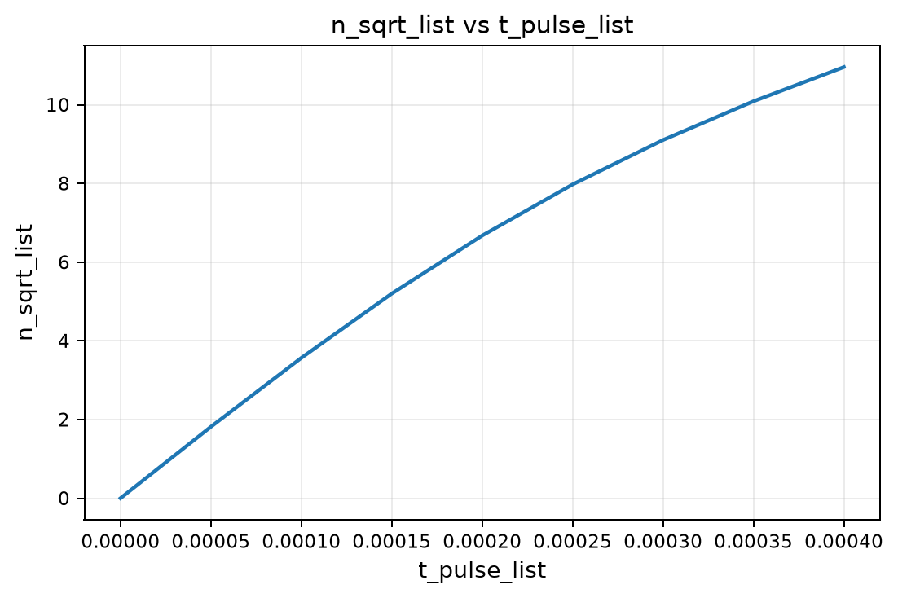

# Simulation summary

Git commit: `1206b1fa72ffba122a0afee9c44c9e90b048dc5a`  
Status: `completed`

# Parameters

```yaml
simulation:
  type: cat_generation
  n_motion: 300
  carrier_rabi_Hz: 170e+3
  comm_detuning_Hz: 0.0
  diff_detuning_Hz: 0.0
  bichro_amp_ratio: 50.0
example:
  cycles: 3.0
  amplitude: 1.0
  noise_std: 0.05
random_seed: 12345
```

# Results

- `scan_results.npz`



# Notes

Add interpretation and follow-up notes here.
