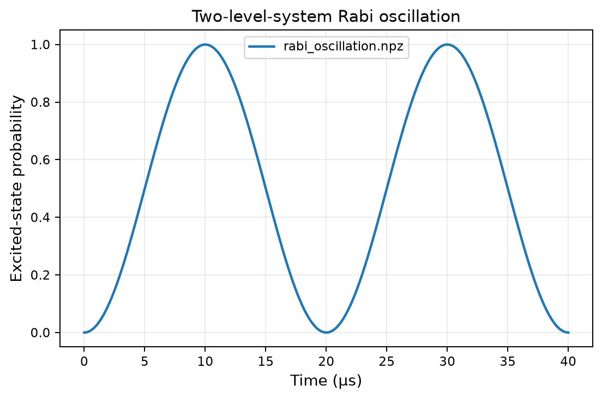

# Simulation summary

Git commit: `aba47ce98cf7760bec8735c51a39d16142f9f629`  
Status: `completed`

# Parameters

```yaml
simulation:
  type: rabi_oscillation
  duration_s: 4.0e-05
  points: 201
  rabi_frequency_Hz: 50000.0
  detuning_Hz: 0.0
```

# Results

- `rabi_oscillation.npz`



# Output

```text
No output captured.
```

# Notes

Add interpretation and follow-up notes here.
